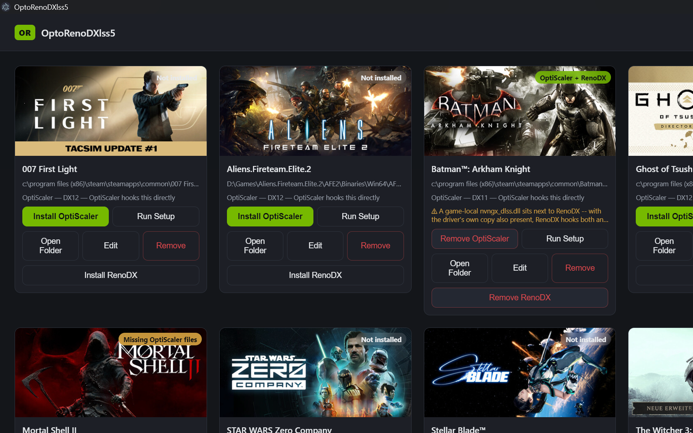

# OptiDLSS5-UI

A Windows desktop app for getting NVIDIA's DLSS 5 Neural Rendering into your games via the
[OptiScaler_DLSSNR](https://github.com/mrcgibb9876-hash/OptiScaler_DLSSNR) build of OptiScaler.

Instead of copying files into every game folder by hand and running a setup script in each one, you
point the app at your games once and click Install.

> **Users:** [README-END-USER.txt](README-END-USER.txt) is the step-by-step setup guide, and it
> ships inside the installer as `README.txt`. This file is about how the app works and why.

## Screenshots

**The manager itself** — each card shows whether OptiScaler is active on that game (not a generic
"Installed"), the Install button becomes Remove once it's there, and known trouble conditions
surface right on the card:



**In-game tuning** is OptiScaler's own native panel (`Alt+Home`) — see
[README-END-USER.txt](README-END-USER.txt).

## What it does

**Finds your games.** Reads Steam's `libraryfolders.vdf` (so every Steam library on every drive),
the Epic and GOG registry entries, and — on request — every fixed drive on the machine. You can add
folders by hand and exclude ones you never want walked. For each game folder it picks the executable
to install beside, scoring on name match, the directory a shipping binary tends to live in, and how
deep it sits, and penalising launchers, crash reporters, updaters and anti-cheat wrappers. It
proposes; you confirm before anything is written.

The drive scan is off by default. On a 4 TB library it takes real time, so it belongs behind a
checkbox you tick rather than on first run.

**Installs OptiScaler per game.** Copies the release files and your NR model file into the game
folder, tracks what's installed against what's current, and re-runs OptiScaler's own setup script
in a console you confirm yourself.

## What OptiScaler covers, and what it doesn't

OptiScaler intercepts the game's own upscaler — NVNGX, FSR or XeSS — and hands the neural model a
properly labelled depth buffer, motion vectors, motion-vector scale, reset flag and pre-exposure
straight from the parameter block. It covers **D3D12 natively, Vulkan (natively and through the
VkOnDx12 bridge), and D3D11 through the Dx11wDx12 bridge**. There is no D3D9 or D3D10 code in
OptiScaler and there isn't going to be — those APIs have nothing to intercept, so games on them are
simply not supported by this app. The card says so plainly instead of recommending an install that
can't work.

## Dependencies: what the app fetches, and the one thing it won't

**The NVIDIA runtime is the exception.** `nvngx_dlssnr.dll` comes out of a driver, it's NVIDIA's,
and it is not ours to redistribute — which is the same reason `package_release.ps1` leaves it out of
the OptiScaler release and the notes tell you to supply your own.

So the app refuses to install until you've pointed it at a copy in Settings. It never fetches one on
your behalf.

## In-game keys

| | |
|---|---|
| **Insert** | OptiScaler's own overlay |
| **Alt+Home** | the DLSS 5 Developer Controls panel |

Both are rebindable, and both panels can be open at once. The panel moved off bare `Home` in
v1.0.1 because `Home` collided with too many games; v1.0.0 still uses it.

## Building

```
npm install
npm start          # run it
npm run dist       # NSIS installer + portable .exe, into dist/
```

Electron 33, Windows x64. No native modules.

## Credits and licensing

`src/library.js` is taken verbatim from [DLSS5-Swapper](https://github.com/rakanki911/DLSS5-Swapper)
— MIT, Copyright (c) 2026 Rakan Alkhaldi. The licence text is kept alongside it in
[LICENSE-DLSS5-Swapper.txt](LICENSE-DLSS5-Swapper.txt); keeping that notice is the whole of what MIT
asks. It is held byte-identical to its upstream so it can be refreshed without a merge — the
adaptation for this app lives in `src/discover.js` instead.

[OptiScaler](https://github.com/optiscaler/OptiScaler) is the upstream this all rests on.
